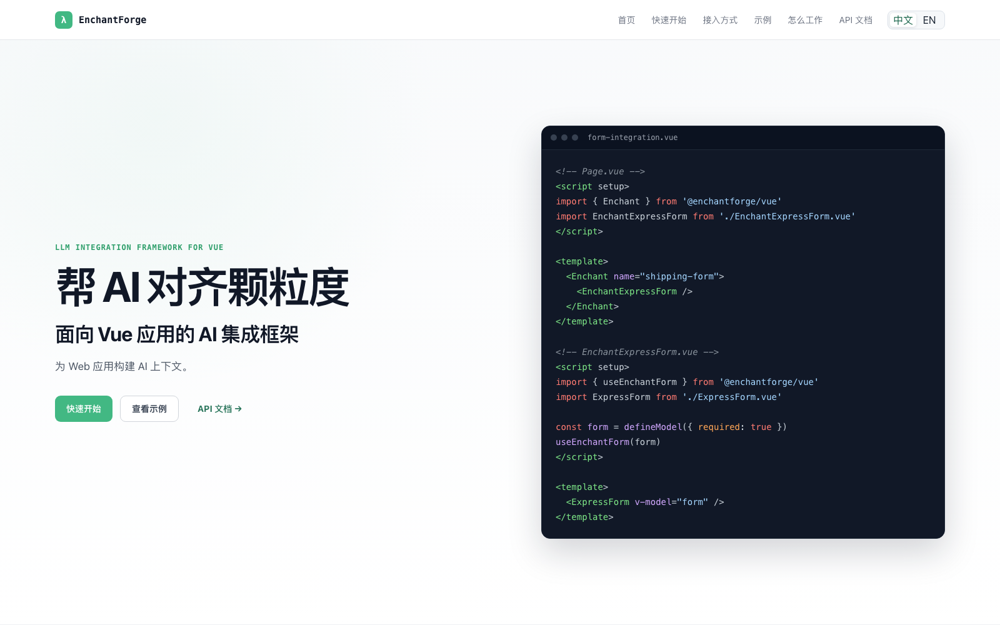

# 【AI编码开发】EnchantForge：让 AI 看见应用

`AI编码开发`

## 应用知道的，AI 也该知道

我们正在把 AI 接入客服、数据分析、管理后台和各种业务系统。每开发一个功能，都要重新
告诉模型页面有什么、数据在哪里、哪些函数可以调用，再为它设计 Prompt、Tools 和执行
流程。

问题不只在于模型是否足够聪明。AI 并不会自动获得应用上下文。

应用本来就知道自己的页面结构、字段含义、当前状态和业务函数。EnchantForge 所做的，
是让应用把完成任务所需的信息直接提供给 AI。

**EnchantForge 是一个面向现有 Vue 应用的 AI 集成框架。**它服务于正在为管理后台、
数据平台和企业应用接入 AI 的开发者。框架收集应用显式提供的上下文，把应用函数转换为
模型可以调用的 Tools，并负责工具执行前的参数、Policy 和目标校验。



## 上下文来自应用

Vue 组件可以通过 wrapper、组合式函数或应用级 API 提供描述、Schema、状态和函数。
组件挂载时，这些信息加入当前上下文；组件卸载后，对应信息和函数随之移除。

应用不必把整个页面交给 AI。它可以只提供一个表单、一个页面，或当前任务涉及的应用
范围。模型获得的是适量、有效且由应用明确提供的信息，而不是对截图或 DOM 的猜测。

最短的接入仍然保持简单：

```vue
<Enchant prompt="根据用户输入填写表单，但不要提交">
  <EnchantExpressForm />
</Enchant>
```

当场景变得复杂，开发者可以继续使用 `useEnchantForm()`、`useEnchantAction()`、
应用级 API、自定义 Agent Client 和低层 `captureContext()`。简单场景不需要理解完整
运行时，复杂系统也不会被高层组件限制。

## 让函数，成为 AI 的能力

应用可以把已有函数注册为 Tools。读取数据、修改草稿、控制界面，或者启动一段完整的
业务流程，都可以使用同一套机制提供给 AI。

模型不能执行任意 JavaScript，也不能调用没有注册的函数。应用定义参数 Schema、执行
函数和 Policy，EnchantForge 在调用发生前重新校验。AI 可以理解需求并组合 Tools，
真正改变应用状态的仍然是应用代码。

聊天框只是其中一种入口。EnchantForge 提供现成的 Aura 助手，也允许业务组件根据语音
转写、系统事件或自身规则主动运行 Agent。自定义前端 Agent、后端 Agent 和不同模型协议
可以复用同一份上下文与 Tools。

## 应用示例

### 自然语言填写表单

快递表单通过 `useEnchantForm()` 提供字段 Schema 和响应式写入函数。用户输入一段包含
姓名、电话、地址和物品信息的自然语言，模型将它转换为结构化工具调用并填写表单。
“不要提交”由应用规则明确限制，AI 只完成草稿。

<!-- 截图：填写完成的快递表单，同时保留用户输入、Aura 回答和未提交状态 -->

### 分析数据，也操作页面

Dashboard 应用包含航空、北京空气质量、NYC Taxi 和 OpenTelemetry 四个数据域。Panel、
Dashboard、指标、维度和查询由配置描述，前端不包含针对某个数据域的定制查询逻辑。

用户提出问题后，Agent 可以按需读取多个 Panel 的查询结果，给出包含具体数据的回答，
并高亮支撑结论的图表。回答与页面操作不是两套相互隔离的流程，而是同一轮 Tool
Calling 的不同结果。

<!-- 截图：OpenTelemetry 分析完成后的 Dashboard，保留回答、多个高亮 Panel 和低亮区域 -->

### 不从聊天框开始

实时坐席辅助示例模拟 ASR online/offline 转写流。业务组件根据稳定的 offline 结果决定
何时运行 Agent，随后查询演示订单接口、检索示例知识、更新工单草稿，并给人工坐席提供
提示。

ASR、订单和知识数据均为模拟内容。这个示例展示的是另一种集成方式：AI 由应用事件
触发，Aura 可以负责展示，也可以完全不参与执行。

<!-- 截图：坐席辅助运行状态，保留转写、订单或知识结果、工单草稿和桌面提示 -->

## 从注册到执行

启用页面内 Debug 后，开发者可以查看当前上下文、导出的 Tools、模型请求、工具参数、
执行结果和错误。可选的 OpenTelemetry Adapter 还可以把 Agent 运行与工具执行接入现有
观测系统。

这些记录不仅服务于演示。模型调用出现偏差时，开发者能够区分问题来自上下文、模型
规划、参数校验，还是应用函数本身。

<!-- 截图：Debug 中的模型请求与工具执行记录 -->

## 从核心库到可运行应用

核心库、基础示例、完整应用示例、门户和数据处理保持独立：

```text
packages/vue           EnchantForge 核心库
examples/vue           基础集成与事件驱动示例
examples/dashboard-vue 可配置 Dashboard 应用
examples/data-sources  公开数据下载、处理与 SQLite 聚合
website                中英文门户与 API 文档
specs                   产品与架构规格
```

模型通过 OpenAI-compatible API 接入，连接信息从 `.env` 读取，并由 Vite dev server
代理。Dashboard 使用公开数据集和本地生成的 OpenTelemetry Demo 信号，不依赖写死在
前端的图表数据。

一个命令可以完成数据准备、配置初始化并启动完整 Dashboard 示例：

```bash
pnpm demo
```

模型或数据服务不可用时，页面会显示错误，不会用预制回答替代模型执行。

## AI 参与的开发过程

编码 Agent 参与了代码检索、实现、测试、文档整理和重构，但框架不是一次提示生成的
结果。每个应用示例都曾暴露设计问题，并反过来改变核心实现。

实时数据刷新曾被错误地视为页面结构变化；Snapshot 曾被用作执行阶段的全局锁；回答和
页面高亮曾经彼此隔离；业务提示词也一度进入核心库。经过实际运行和持续重构，项目最终
明确了稳定的产品边界：

- 页面结构进入 metadata，实时数据通过 Tools 按需读取
- Snapshot 用于规划上下文和调试，不阻止仍然有效的函数执行
- Core 管理注册、上下文、工具和执行机制，业务语义与副作用留在应用

规格文档、自动化测试和 Git 提交记录保留了这条开发过程。

## 为什么叫 EnchantForge

语言模型最有价值的部分，也正是传统流程无法完全枚举和计算的部分。它更像魔法：能够
理解和生成，但结果并不总是确定。

`Enchant` 代表这种能力。`Forge` 代表围绕它建立的工程结构：上下文、Schema、Policy、
执行器和运行记录。

EnchantForge 不试图把大模型伪装成一个永远确定的业务函数。它为这种不确定的智能提供
清楚、稳定、可以检查的应用接口。

项目仓库：[提交前填写]

在线演示：[提交前填写]
